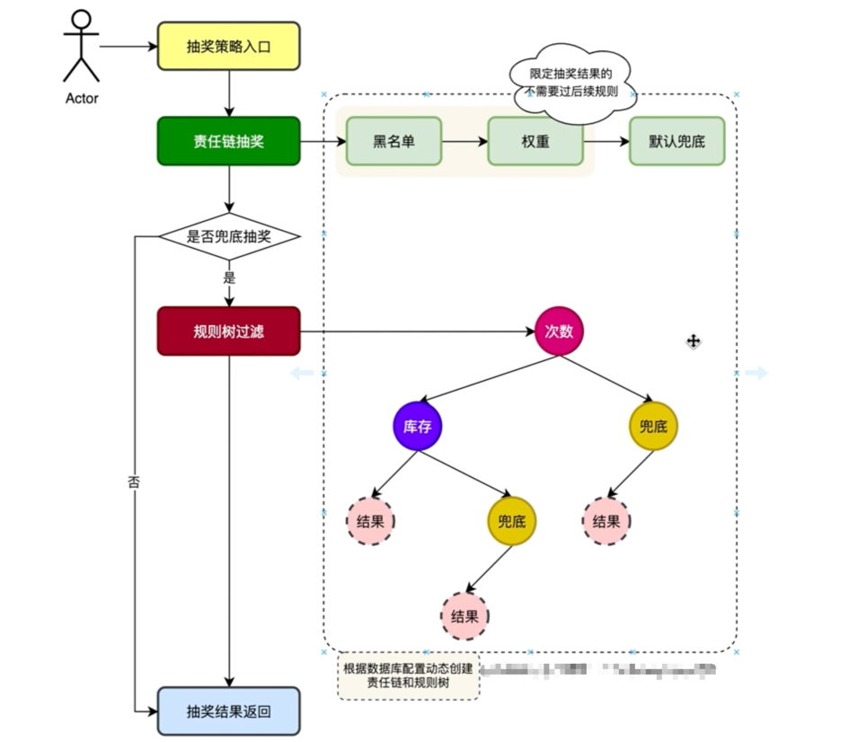

## 设计模式的演化
从过滤 -> 责任链 -> 规则树

## 过滤
黑名单 -> 权重过滤 -> 兜底(不用权重商品)
> 需要根据上一个过滤的返回值来判断是否执行下一个过滤

## 责任链 适用于前后有关联关系的
黑名单 -> 权重过滤 -> 兜底(不用权重商品)
> 需要注意责任链构建时的顺序和获取下一个节点、执行

## 规则树 适用于跳跃式的条件，二叉树形式，不是它就是另一条路

